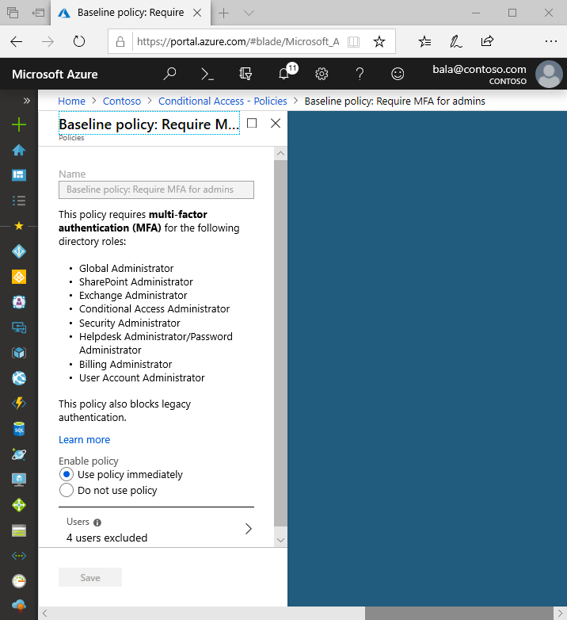

# Baseline policy: Require MFA for admins

Users with access to privileged accounts have unrestricted access to your environment. Due to the power these accounts have, you should treat them with special care. One common method to improve the protection of privileged accounts is to require a stronger form of account verification when they are used to sign-in. In Azure Active Directory, you can get a stronger account verification by requiring multi-factor authentication (MFA).

**Require MFA for admins** is a [baseline policy](concept-baseline-protection.md) that requires MFA every time one of the following privileged administrator roles signs in:

* Global administrator
* SharePoint administrator
* Exchange administrator
* Conditional Access administrator
* Security administrator
* Helpdesk administrator / Password administrator
* Billing administrator
* User administrator

Upon enabling the Require MFA for admins policy, the above nine administrator roles will be required to register for MFA using the Authenticator App. Once MFA registration is complete, administrators will need to perform MFA every single time they sign-in.

## Deployment considerations

Because the **Require MFA for admins** policy applies to all critical administrators, several considerations need to be made to ensure a smooth deployment. These considerations include identifying users and service principles in Azure AD that cannot or should not perform MFA, as well as applications and clients used by your organization that do not support modern authentication.

### Legacy protocols

Legacy authentication protocols (IMAP, SMTP, POP3, etc.) are used by mail clients to make authentication requests. These protocols do not support MFA. Most of the account compromises seen by Microsoft are caused by bad actors performing attacks against legacy protocols attempting to bypass MFA. To ensure that MFA is required when logging into an administrative account and bad actors aren’t able to bypass MFA, this policy blocks all authentication requests made to administrator accounts from legacy protocols.

> [!WARNING]
> Before you enable this policy, make sure your administrators aren’t using legacy authentication protocols. See the article [How to: Block legacy authentication to Azure AD with Conditional Access](howto-baseline-protect-legacy-auth.md#identify-legacy-authentication-use) for more information.

### User exclusions

This baseline policy provides you the option to exclude users. Before enabling the policy for your tenant, we recommend excluding the following accounts:

* **Emergency access** or **break-glass** accounts to prevent tenant-wide account lockout. In the unlikely scenario all administrators are locked out of your tenant, your emergency-access administrative account can be used to log into the tenant take steps to recover access.
   * More information can be found in the article, [Manage emergency access accounts in Azure AD](../users-groups-roles/directory-emergency-access.md).
* **Service accounts** and **service principles**, such as the Azure AD Connect Sync Account. Service accounts are non-interactive accounts that are not tied to any particular user. They are normally used by back-end services and allow programmatic access to applications. Service accounts should be excluded since MFA can’t be completed programmatically.
   * If your organization has these accounts in use in scripts or code, consider replacing them with [managed identities](../managed-identities-azure-resources/overview.md). As a temporary workaround, you can exclude these specific accounts from the baseline policy.
* Users who do not have or will not be able to use a smart phone.
   * This policy requires administrators to register for MFA using the Microsoft Authenticator app.

## Enable the baseline policy

The policy **Baseline policy: Require MFA for admins** comes pre-configured and will show up at the top when you navigate to the Conditional Access blade in Azure portal.

To enable this policy and protect your administrators:

1. Sign in to the **Azure portal** as global administrator, security administrator, or Conditional Access administrator.
1. Browse to **Azure Active Directory** > **Conditional Access**.
1. In the list of policies, select **Baseline policy: Require MFA for admins**.
1. Set **Enable policy** to **Use policy immediately**.
1. Add any user exclusions by clicking on **Users** > **Select excluded users** and choosing the users that need to be excluded. Click **Select** then **Done**.
1. Click **Save**.

> [!WARNING]
> There was an option **Automatically enable policy in the future** when this policy was in preview. We removed this option to minimize sudden user impact. If you selected this option when it was available, **Do not use policy** is automatically now selected. If they want to use this baseline policy, see steps above to enable it.

## Next steps

For more information, see:

* [Conditional Access baseline protection policies](concept-baseline-protection.md)
* [Five steps to securing your identity infrastructure](../../security/azure-ad-secure-steps.md)
* [What is Conditional Access in Azure Active Directory?](overview.md)
