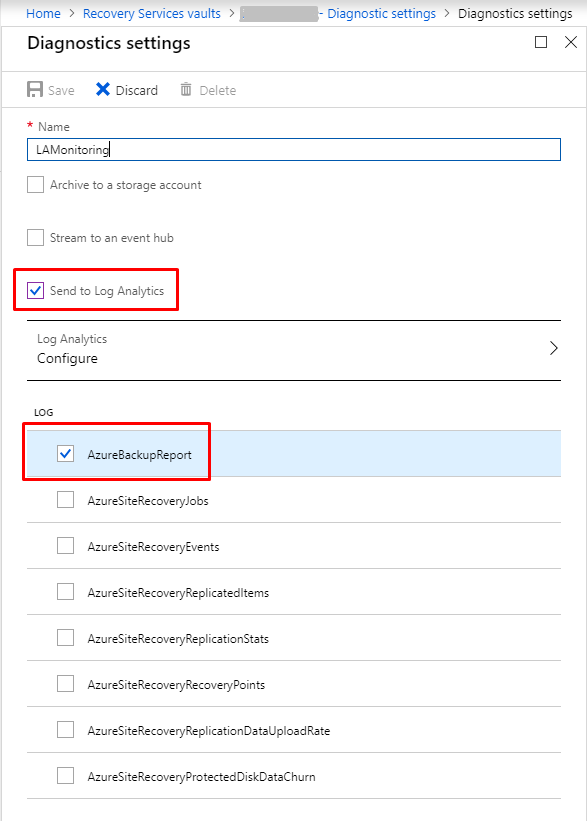
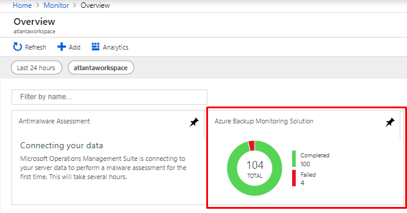
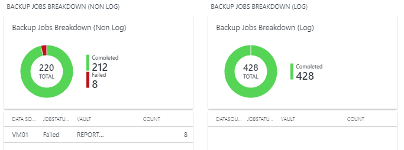
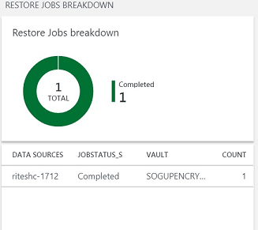
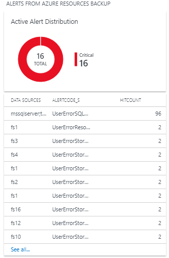
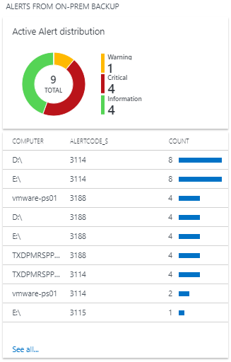
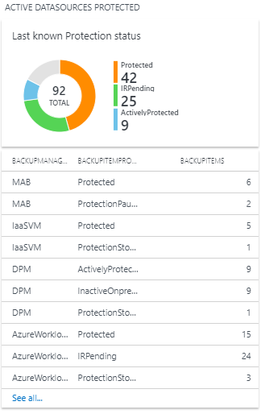
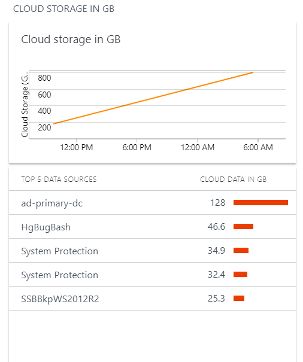
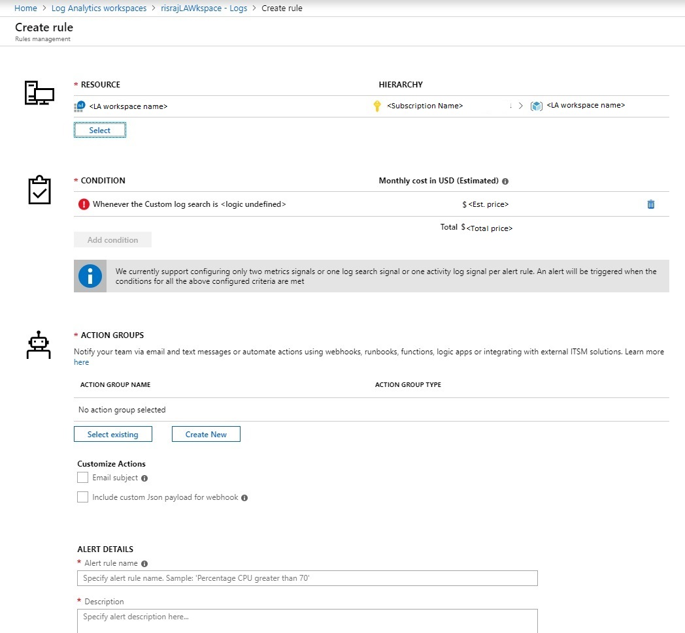

# Monitoring at scale using Azure Monitor

The [built-in monitoring and alerting article](backup-azure-monitoring-built-in-monitor.md) listed the monitoring and alerting capabilities in a single Recovery services vault and which is offered without any additional management infrastructure. However the built-in service is limited in the following scenarios.

- Monitoring data from multiple RS vaults across subscriptions
- If email is NOT the preferred notification channel
- If users want to get alerted for more scenarios
- If you want to view information from on-premises component such as System Center DPM (SC-DPM) in Azure, which is not shown in [Backup Jobs](backup-azure-monitoring-built-in-monitor.md#backup-jobs-in-recovery-services-vault) or [Backup Alerts](backup-azure-monitoring-built-in-monitor.md#backup-alerts-in-recovery-services-vault) in portal.

## Using Log Analytics Workspace

> [!NOTE]
> Data from Azure VM backups, MAB Agent, System Center DPM (SC-DPM), SQL backups in Azure VMs, and Azure File Share backups is being pumped to the Log Analytics workspace via diagnostic settings. Support for Microsoft Azure Backup Server (MABS) is coming soon.

We are leveraging the capabilities of two Azure services - **Diagnostic settings** (to send data from multiple Azure Resource Manager resources to another resource) and **Log Analytics** (LA - to generate custom alerts where you can define other notification channels using Action groups) for monitoring at scale. The following sections detail on how to use LA to monitor Azure Backup at scale.

### Configuring Diagnostic settings

An Azure Resource Manager resource such as Azure Recovery services vault records all possible information about scheduled operations and user triggered operations as diagnostic data. Click the 'Diagnostic settings' in the monitoring section and specify the target for diagnostic data of the RS Vault.



You can select an LA workspace from another subscription as the target. *By selecting the same LA workspace for multiple RS vaults, you can monitor vaults across subscriptions in a single place.* Select 'AzureBackupReport' as the log to channel all Azure Backup related information to the LA workspace.

> [!IMPORTANT]
> After you have completed the configuration, you should wait for 24 hours for initial data push to complete. Thereafter all the events are pushed as mentioned in the [frequency section](#diagnostic-data-update-frequency).

### Deploying solution to Log Analytics workspace

Once the data is inside LA workspace, [deploy a GitHub template](https://azure.microsoft.com/resources/templates/101-backup-oms-monitoring/) onto LA to visualize the data. Make sure you give the same resource group, workspace name, and workspace location to properly identify the workspace and then install this template on it.

### View Azure Backup data using Log Analytics (LA)

Once the template is deployed, the solution for monitoring Azure Backup will show up in the workspace summary region. You can traverse via

- Azure Monitor -> "More" under 'Insights' section and choose the relevant workspace OR
- Log Analytics Workspaces -> select the relevant workspace -> 'Workspace summary' under the General section.



On clicking the tile, the designer template opens up a series of graphs about the basic monitoring data from Azure Backup such as

#### All Backup jobs



#### Restore Jobs



#### Inbuilt Azure Backup alerts for Azure Resources



#### Inbuilt Azure Backup alerts for On-prem Resources



#### Active Datasources



#### RS Vault Cloud Storage



The above graphs are provided with the template and the customer is free to edit/add more graphs.

> [!IMPORTANT]
> When you deploy the template, it essentially creates a read-only lock and you need to remove it to edit the template and save. To remove locks, look in the 'Locks' pane under the 'Settings' section of the Log Analytics workspace.

### Create alerts using Log Analytics

Azure Monitor allows users to create their own alerts from LA workspace where you can *leverage the Azure Action groups to select your preferred notification mechanism*. Click on any of the graphs above to open the 'Logs' section of LA workspace ***where you can edit the queries and create alerts on top of them***.


Clicking on "New Alert Rule" as shown above will open the Azure Monitor alert creation screen.

As you can notice below, the resource is already marked as the LA workspace and action group integration is provided.



> [!IMPORTANT]
> Please note that the relevant pricing impact of creating this query is provided [here](https://azure.microsoft.com/pricing/details/monitor/).

#### Alert condition

The key aspect is the triggering condition of the alert. Clicking on 'Condition' will automatically load the Kusto query in the 'Logs' screen as shown below and you can edit it to suit your scenario. Some sample Kusto queries are provided in the [section below](#sample-kusto-queries).


Edit the Kusto query, if necessary, select the right threshold (which will decide when the alert will be fired), the right period (time window for which the query is run), and the frequency. For example: If the threshold is greater than 0, the period is 5 minutes and the frequency is 5 minutes, then the rule is translated as "Run the query every 5 minutes for the last 5 minutes and if the number of results is greater than 0, notify me via the selected action group"

#### Action group integration

Action groups specify the notification channels available to the user. Clicking on "Create New" under "Action groups" section shows the available list of notification mechanisms.


Learn more about the [Alerts from LA workspace](https://docs.microsoft.com/azure/azure-monitor/platform/alerts-log) and about [Action groups](https://docs.microsoft.com/azure/azure-monitor/platform/action-groups) from Azure Monitor documentation.

Hence you can satisfy all alerting and monitoring requirements from LA alone or use it as a supplementary technique to in-built notification mechanisms.

### Sample Kusto queries

The default graphs would give you Kusto queries for basic scenarios on which you can build alerts. You can also modify them to get the data you wish to get alerted on. Here we provide some sample Kusto queries that can you paste in 'Logs' window and then create an alert on the query.

#### All successful backup jobs

````Kusto
AzureDiagnostics
| where Category == "AzureBackupReport"
| where SchemaVersion_s == "V2"
| where OperationName == "Job" and JobOperation_s == "Backup"
| where JobStatus_s == "Completed"
````

#### All failed backup jobs

````Kusto
AzureDiagnostics
| where Category == "AzureBackupReport"
| where SchemaVersion_s == "V2"
| where OperationName == "Job" and JobOperation_s == "Backup"
| where JobStatus_s == "Failed"
````

#### All successful Azure VM backup jobs

````Kusto
AzureDiagnostics
| where Category == "AzureBackupReport"
| where SchemaVersion_s == "V2"
| extend JobOperationSubType_s = columnifexists("JobOperationSubType_s", "")
| where OperationName == "Job" and JobOperation_s == "Backup" and JobStatus_s == "Completed" and JobOperationSubType_s != "Log" and JobOperationSubType_s != "Recovery point_Log"
| join kind=inner
(
    AzureDiagnostics
    | where Category == "AzureBackupReport"
    | where OperationName == "BackupItem"
    | where SchemaVersion_s == "V2"
    | where BackupItemType_s == "VM" and BackupManagementType_s == "IaaSVM"
    | distinct BackupItemUniqueId_s, BackupItemFriendlyName_s
    | project BackupItemUniqueId_s , BackupItemFriendlyName_s
)
on BackupItemUniqueId_s
| extend Vault= Resource
| project-away Resource
````

#### All successful SQL Log backup jobs

````Kusto
AzureDiagnostics
| where Category == "AzureBackupReport"
| where SchemaVersion_s == "V2"
| extend JobOperationSubType_s = columnifexists("JobOperationSubType_s", "")
| where OperationName == "Job" and JobOperation_s == "Backup" and JobStatus_s == "Completed" and JobOperationSubType_s == "Log"
| join kind=inner
(
    AzureDiagnostics
    | where Category == "AzureBackupReport"
    | where OperationName == "BackupItem"
    | where SchemaVersion_s == "V2"
    | where BackupItemType_s == "SQLDataBase" and BackupManagementType_s == "AzureWorkload"
    | distinct BackupItemUniqueId_s, BackupItemFriendlyName_s
    | project BackupItemUniqueId_s , BackupItemFriendlyName_s
)
on BackupItemUniqueId_s
| extend Vault= Resource
| project-away Resource
````

#### All successful MAB Agent backup jobs

````Kusto
AzureDiagnostics
| where Category == "AzureBackupReport"
| where SchemaVersion_s == "V2"
| extend JobOperationSubType_s = columnifexists("JobOperationSubType_s", "")
| where OperationName == "Job" and JobOperation_s == "Backup" and JobStatus_s == "Completed" and JobOperationSubType_s != "Log" and JobOperationSubType_s != "Recovery point_Log"
| join kind=inner
(
    AzureDiagnostics
    | where Category == "AzureBackupReport"
    | where OperationName == "BackupItem"
    | where SchemaVersion_s == "V2"
    | where BackupItemType_s == "FileFolder" and BackupManagementType_s == "MAB"
    | distinct BackupItemUniqueId_s, BackupItemFriendlyName_s
    | project BackupItemUniqueId_s , BackupItemFriendlyName_s
)
on BackupItemUniqueId_s
| extend Vault= Resource
| project-away Resource
````

### Diagnostic data update frequency

The diagnostic data from the vault is pumped to the LA workspace with some lag. Every event arrives to the LA workspace ***with a lag of 20-30 mins after it is pushed from the RS vault.***

- The backup service built-in alerts (across all solutions) are pushed as soon as they are created. Which means they typically appear in the LA workspace after a lag of 20-30 mins.
- Adhoc backup jobs and restore jobs (across all solutions) are pushed as soon as they ***are completed***.
- The scheduled backup jobs from all solutions (except SQL backup) are pushed as soon as they ***are completed***.
- For SQL backup,since we can have log backups every 15 mins, for all the completed scheduled backup jobs, including logs, the information is batched and pushed every 6 hours.
- All other information such as backup item, policy, Recovery points, storage etc. across all solutions are pushed **atleast once per day.**
- A change in the backup configuration such as changing policy, editing policy etc. triggers a push of all related backup information.

## Using RS Vault's Activity logs

You can also use Activity logs to get notification for events such as backup success.

> [!CAUTION]
> **Please note this is only applicable for Azure VM backups.** You cannot use this for other solutions such as Azure Backup Agent, SQL backups within Azure, Azure Files etc.

### Sign in into Azure portal

Sign in into the Azure portal and proceed to the relevant Azure Recovery Services vault and click the “Activity log” section in the properties.

### Identify appropriate log and create alert

Apply the filters shown in the following picture to verify whether you are receiving activity logs for successful backups. Change the timespan accordingly to view records.


Click on the operation name it will display the operation and relevant details.


Click **New alert rule** to open the **Create rule** screen, here you can create alert using steps described in this [article](https://docs.microsoft.com/azure/azure-monitor/platform/alerts-activity-log).

Here the resource is the Recovery Service vault itself and hence you need to repeat the same action for all the vaults in which you want notification via activity logs. The condition will not have any threshold, period, frequency since this is an event-based alert. As soon as the relevant activity log is generated, the alert is fired.

## Recommendation

***All alerts created from activity logs and LA workspaces can be viewed in Azure Monitor in the 'Alerts' pane to the left.***

While the notification via Activity logs can be used, ***Azure Backup service highly recommends to use LA for monitoring at scale and NOT activity logs for the following reasons***.

- **Limited Scenarios:** Applicable only for Azure VM backups and should be repeated for every RS vault.
- **Definition fit:** The scheduled backup activity doesn't fit with the latest definition of activity logs and aligns with [diagnostic logs](https://docs.microsoft.com/azure/azure-monitor/platform/diagnostic-logs-overview#what-you-can-do-with-diagnostic-logs). This lead to unexpected impact when the data pumping via activity log channel is changed as pointed below.
- **Problems with Activity log channel:** We have moved to a new model of pumping Activity logs from Azure Backup on Recovery Services vaults. Unfortunately, the move has affected generation of activity logs in Azure Sovereign Clouds. If Azure Sovereign Cloud users created/configured any alerts from Activity logs via Azure Monitor, they would not be triggered. Also, in all Azure public regions, if a user is collecting Recovery Services Activity logs into a Log Analytic workspace as mentioned [here](https://docs.microsoft.com/azure/azure-monitor/platform/collect-activity-logs), these logs also would not appear.

Hence it is highly recommended to use Log Analytic workspace for monitoring and alerting at scale for all your Azure Backup protected workloads.

## Next steps

- Refer to [Log analytics data model](backup-azure-log-analytics-data-model.md) to create custom queries.
